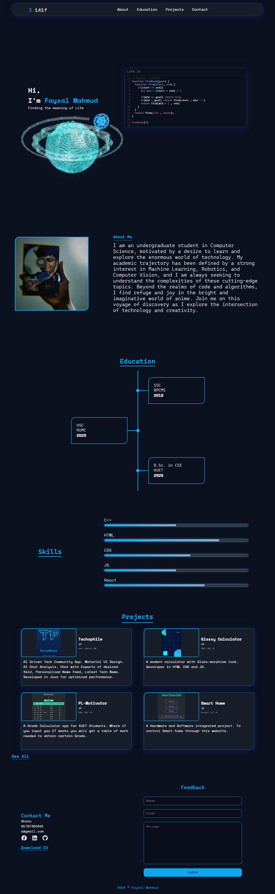
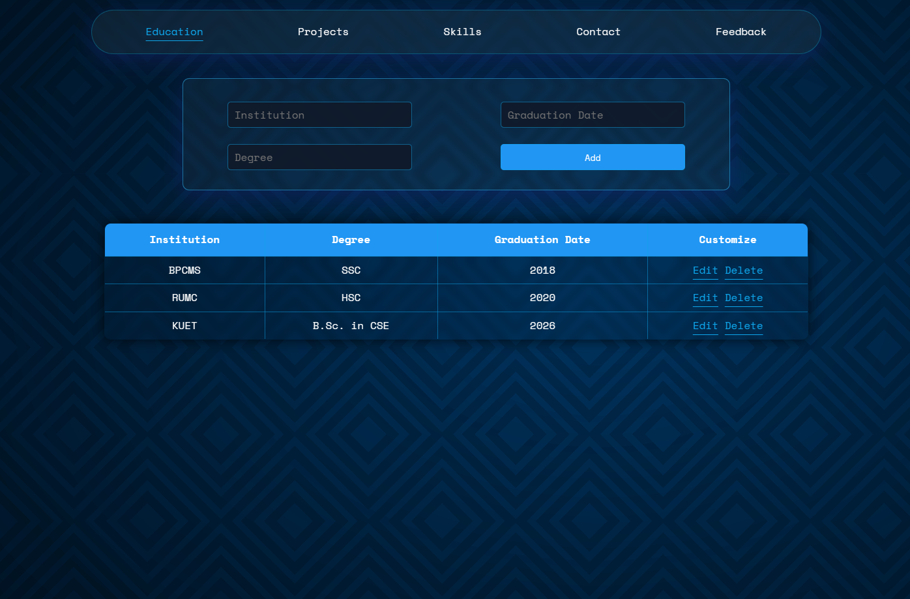
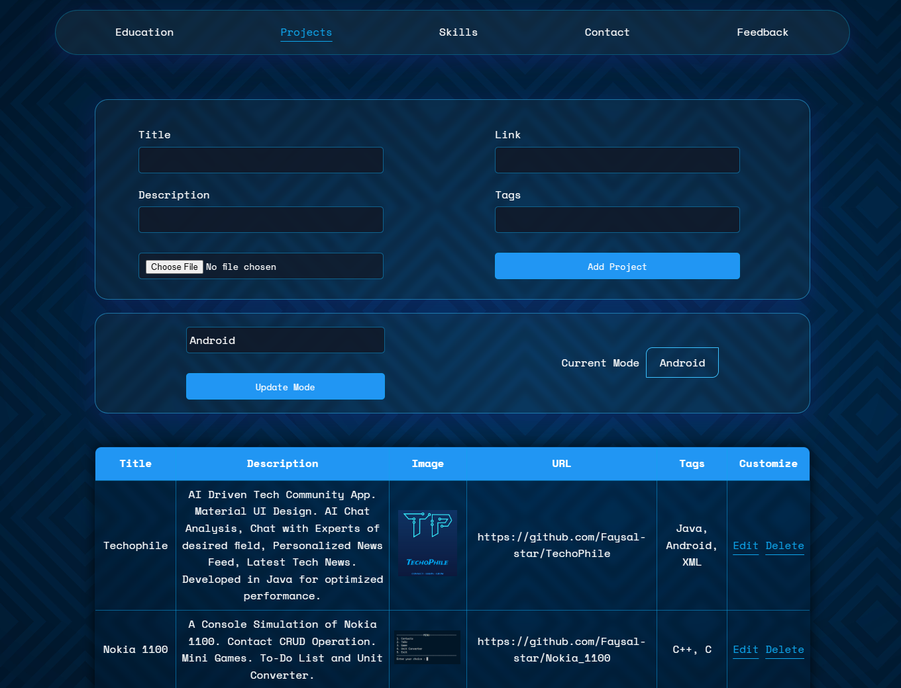
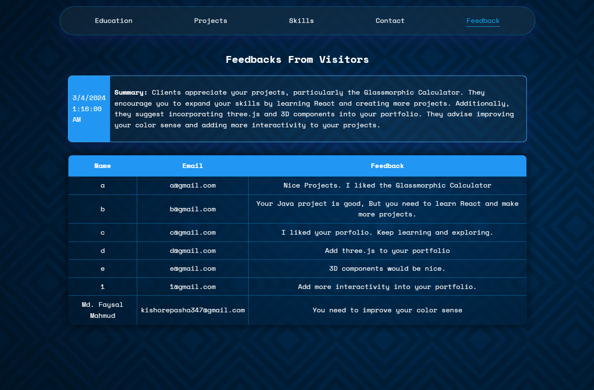

# Portfolio Assignment for CSE 3100

### Web Programming Lab Assignment for 3 rd  Year 1 st  Term.

This is an AI Integrated Dynamic Portfolio Project with  Node.js + ASP.NET Backend and MSSQL Database.

<u><b>Key Features</b></u>

- SQL Database for  storing Education , Projects , Feedbacks etc.
- Backend & Admin Panel using ASP.NET
- Server using Express.js
- Gemini Pro Model to Summarize Feedbacks
- Sorting best projects according to job, using AI

## How to Run

1. Import the ``portfolio_DB.sql`` file into MSSMS and generate the Database with some pre-defined data.
2. Update the Connection Strings in ``server>index.js`` and ``admin_panel>Web.config``.
3. Run ``npm install`` inside ``server`` folder to install the dependecies.
4. Get your Gemini API key from [ai.google.dev](https://ai.google.dev) , and paste it into ``server>.env`` as ``API_KEY = _____``
5. Open the ``admin_panel>portfolio_admin.sln`` in Visual Studio and run to view admin panel.
6. Run the ``server>index.js`` . You can use nodemon or ``node index.js``.
7. Run the ``client>index.html`` to view the portfolio. You have to use Liver Server to avoid CORS Policy error.

## Portfolio

## Admin Panel

